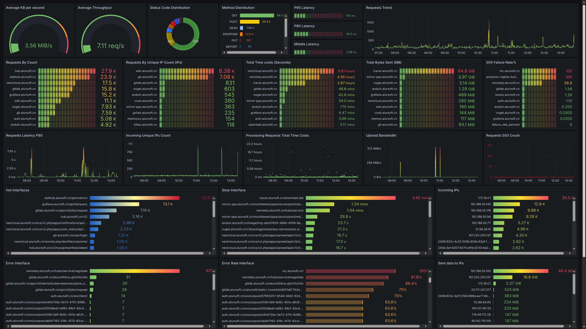

# CaddyVisualize



## How to install

Before installing, make sure you have caddy installed and running.

### Step 1: Adjust your Caddyfile

Add the log part of your caddy file.

```caddyfile
{
    log {
        format json
        output file /data/caddy/logs/web.log {
            roll_size 1gb
            roll_uncompressed
        }
        level debug
    }
    servers :443 {
        listener_wrappers {
            http_redirect
            tls
        }
    }
}
```

In the configuration above, the log file is set to `/data/caddy/logs/web.log`. Make sure this path exists and is writable by the Caddy process.

Try to read the log from the STDOUT. It may look like this:

```bash
{"level":"debug","ts":1753604514.3975098,"logger":"http.handlers.reverse_proxy","msg":"selected upstream","dial":"stathub_stathubserver:5000","total_upstreams":1}
{"level":"debug","ts":1753604514.3991885,"logger":"http.handlers.reverse_proxy","msg":"upstream roundtrip","upstream":"stathub_stathubserver:5000","duration":0.001577048,"request":{"remote_ip":"119.29.247.197","remote_port":"57854","client_ip":"119.29.247.197","proto":"HTTP/1.1","method":"POST","host":"stathub.aiursoft.cn","uri":"/api/metrics","headers":{"X-Forwarded-Host":["stathub.aiursoft.cn"],"Via":["1.1 Caddy"],"Accept":["application/json"],"Content-Type":["application/json; charset=utf-8"],"Content-Length":["2604"],"User-Agent":[""],"X-Forwarded-For":["119.29.247.197"],"X-Forwarded-Proto":["https"]},"tls":{"resumed":false,"version":772,"cipher_suite":4865,"proto":"","server_name":"stathub.aiursoft.cn"}},"headers":{"X-Frame-Options":["SAMEORIGIN"],"Content-Security-Policy":["frame-ancestors 'self'"],"Content-Type":["application/json; charset=utf-8"],"Date":["Sun, 27 Jul 2025 08:21:53 GMT"],"Server":["Kestrel"],"Vary":["Accept-Encoding"]},"status":201}
{"level":"info","ts":1753604514.3996112,"logger":"http.log.access","msg":"handled request","request":{"remote_ip":"119.29.247.197","remote_port":"57854","client_ip":"119.29.247.197","proto":"HTTP/1.1","method":"POST","host":"stathub.aiursoft.cn","uri":"/api/metrics","headers":{"Accept":["application/json"],"Content-Type":["application/json; charset=utf-8"],"Content-Length":["2604"]},"tls":{"resumed":false,"version":772,"cipher_suite":4865,"proto":"","server_name":"stathub.aiursoft.cn"}},"bytes_read":2604,"user_id":"","duration":0.002170407,"size":56,"status":201,"resp_headers":{"Alt-Svc":["h3=\":443\"; ma=2592000"],"Vary":["Accept-Encoding"],"Content-Security-Policy":["frame-ancestors 'self'"],"Date":["Sun, 27 Jul 2025 08:21:53 GMT"],"Server":["Kestrel"],"Via":["1.1 Caddy"],"Strict-Transport-Security":["max-age=63072000"],"X-Frame-Options":["SAMEORIGIN"],"Content-Type":["application/json; charset=utf-8"]}}
{"level":"debug","ts":1753604514.6455557,"logger":"http.handlers.reverse_proxy","msg":"selected upstream","dial":"authentik_server:9000","total_upstreams":1}
```

### Step 2: Deploy ClickHouse

```yaml
  clickhouse:
    image: clickhouse/clickhouse-server:latest
    environment:
      - CLICKHOUSE_USER=default
      - CLICKHOUSE_PASSWORD=123456
    ports:
      - target: 8123
        published: 8123
        protocol: tcp
        mode: host
      - target: 9000
        published: 9000
        protocol: tcp
        mode: host
    volumes:
      - click-house-data:/var/lib/clickhouse
```

### Step 3: Deploy Necessary tables

You can log in your clickhouse server using this command:

```bash
sudo docker exec -it 99dae96430f9 clickhouse-client --user default
```

The password is `123456` as set in the previous step.

Then, create the necessary tables by running the following SQL commands:

```sql
CREATE DATABASE IF NOT EXISTS logs;

CREATE TABLE logs.caddy_requests (
  ts             DateTime64(3, 'UTC'),
  level          LowCardinality(String),
  logger         LowCardinality(String),
  msg            String,
  remote_ip      String,
  remote_port    UInt16,
  method         LowCardinality(String),
  host           LowCardinality(String),
  uri            String,
  status         UInt16,
  duration_ms    Float32,
  bytes_sent     UInt64,
  user_agent     String,
  err_id         LowCardinality(String),
  err_trace      String
)
ENGINE = MergeTree()
-- 按“年-月”分区，也可改成 toYYYYMMDD(ts) 做日分区
PARTITION BY toYYYYMM(ts)
-- 主键兼排序键
ORDER BY (ts, host, remote_ip)
-- 自动 90 天后清理旧数据（可选）
TTL ts + INTERVAL 90 DAY
SETTINGS index_granularity = 8192;
```

To verify the table is created successfully, you can run:

```sql
SHOW TABLES FROM logs;

DESCRIBE TABLE logs.caddy_requests;
```

### Step 4: Build CaddyVisualize

Now you can build this project with the following command:

```bash
docker build -t caddyvisualize .
```

Or you can simply download the [Dockerfile](./Dockerfile) and build it with the command above.

### Step 5: Run CaddyVisualize

You can use the following `docker-compose.yml` to run CaddyVisualize along with Caddy and ClickHouse:

```yaml
version: '3.9'

services:
  sites:
    image: caddy
    ports:
        published: 80
        protocol: tcp
        mode: host
      - target: 443
        published: 443
        protocol: tcp
        mode: host
    networks:
      - internal
    volumes:
      - sites-data:/data

  clickhouse:
    image: clickhouse/clickhouse-server:latest
    environment:
      - CLICKHOUSE_USER=default
      - CLICKHOUSE_PASSWORD=123456
    networks:
      - internal
    volumes:
      - click-house-data:/var/lib/clickhouse

  caddyvisualize:
    image: caddyvisualize
    environment:
      - LOG_FILE=/data/caddy/logs/web.log
      - CLICKHOUSE_URL=http://clickhouse:8123
      - CLICKHOUSE_USER=default
      - CLICKHOUSE_PASSWORD=123456
      - CLICKHOUSE_DATABASE=logs
      - CLICKHOUSE_TABLE=caddy_requests
    depends_on:
      - clickhouse
    networks:
      - internal
    volumes:
      - sites-data:/data:ro

volumes:
    sites-data:
    click-house-data:
networks:
    internal:
      driver: bridge
```

However, make sure the generated data of caddy are consistent between `caddy` and `caddyvisualize`. In the example above, `caddy` will save the logs to `/data/caddy/logs/web.log`, and `caddyvisualize` will read from the same path.

### Step 6: Check the data in clickhouse

Now you can check the data in ClickHouse by running the following command:

```sql
SELECT
    ts,
    level,
    logger,
    msg,
    remote_ip,
    remote_port,
    method,
    host,
    status,
    duration_ms,
    bytes_sent,
    uri
FROM logs.caddy_requests
ORDER BY ts DESC
LIMIT 30
FORMAT Pretty
```

This will show you the latest 30 requests logged by Caddy.

### Step 7: Visualize the data with Grafana

You can use Grafana to visualize the data in ClickHouse. 

1. Install Grafana and add ClickHouse as a data source.
2. Import the dashboard from the [file](./dashboard.json) provided in this repository.
